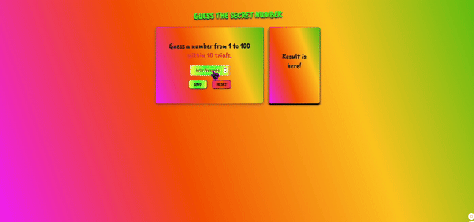

# Guess The Secret Number Game 

## Description
Project aims to create find the number game (between 0 to 100).

## Problem Statement

- Your company has recently started on a project that aims to create a find the number game. So you and your colleagues have started to work on the project.
- Each time the application is opened, it will keep a random number between 1-100 in the background.
- The user makes a guess.
- The number is compared and guided up/down until the user guess the correct number.
- For example:
    - Let your number be 15 and user guessed '5' the first time.
    - Prompt the user to "Enter a number between 5 and 100".
    - If the user guessed 68 on the second guess, this time you should prompt "Enter a number between 5 (the lowest guess closest to your number) to 68 (the closest big guess to your number)".


## Project Skeleton 

```
01-find-number(folder)
|
|----readme.md         # Given to the students (Definition of the project)          
|----solution
        |----index.html  
        |----style.css   
        |----index.js
```

## Expected Outcome



## Objective

Build a Find the Number Game (Between 0 to 100)

## Live Page

[Click for live page]()
